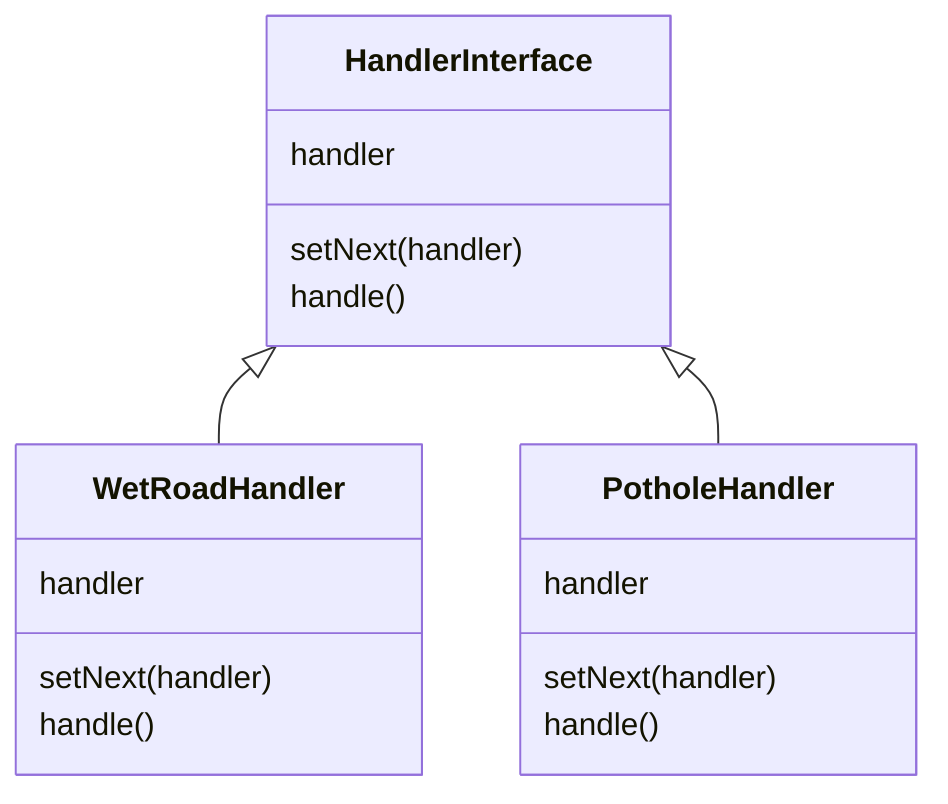

# Chain of Responsibility
## Goal
Increase reusability for a series of nested handlers

## Represent sequential checks as a chain of handlers

```mermaid
classDiagram
class HandlerInterface
HandlerInterface    :   handler
HandlerInterface    :   setNext(handler)
HandlerInterface    :   handle()

class WetRoadHandler
WetRoadHandler    :   handler
WetRoadHandler    :   setNext(handler)
WetRoadHandler    :   handle()

class PotholeHandler
PotholeHandler    :   handler
PotholeHandler    :   setNext(handler)
PotholeHandler    :   handle()

HandlerInterface    <|-- WetRoadHandler
HandlerInterface    <|-- PotholeHandler
```