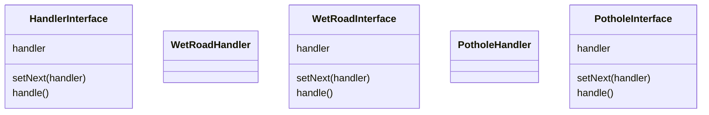

# Chain of Responsibility
Increase reusability for a series of nested handlers

## Represent sequential checks as a chain of handlers

```mermaid
classDiagram
class HandlerInterface
HandlerInterface    :   handler
HandlerInterface    :   setNext(handler)
HandlerInterface    :   handle()
class WetRoadHandler
WetRoadInterface    :   handler
WetRoadInterface    :   setNext(handler)
WetRoadInterface    :   handle()
class PotholeHandler
PotholeInterface    :   handler
PotholeInterface    :   setNext(handler)
PotholeInterface    :   handle()
```