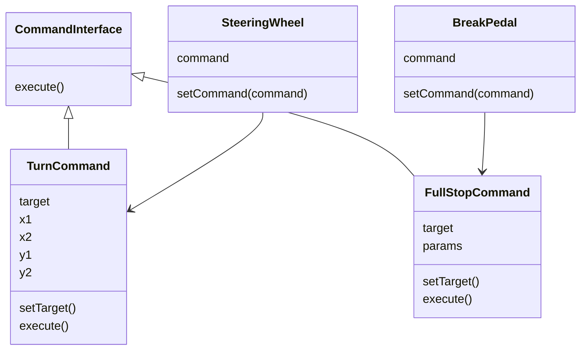

# Command
+ Reduce coupling between classes that call each other
+ Make functionality reusable

## Expresses different events that can happen as their own classes

```mermaid
classDiagram
class CommandInterface
class FullStopCommand
class TurnCommand
class BreakPedal
class SteeringWheel

CommandInterface <|--   TurnCommand
CommandInterface <|--   FullStopCommand
BreakPedal       -->    FullStopCommand
SteeringWheel    -->    TurnCommand

CommandInterface    :   execute()

FullStopCommand     :   target
FullStopCommand     :   params
FullStopCommand     :   setTarget()
FullStopCommand     :   execute()

TurnCommand     :   target
TurnCommand     :   x1
TurnCommand     :   x2
TurnCommand     :   y1
TurnCommand     :   y2
TurnCommand     :   setTarget()
TurnCommand     :   execute()

BreakPedal      :   command
BreakPedal      :   setCommand(command)

SteeringWheel   :   command
SteeringWheel   :   setCommand(command)

```