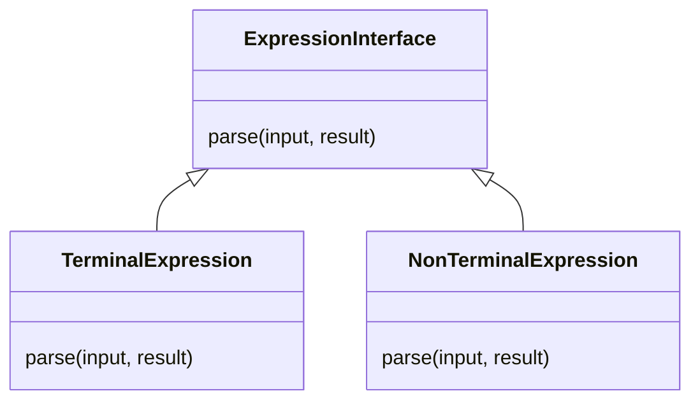

# The Interpreter
We need the software to understand a language that is not implemented (i.e. decoding Roman numerals)

### Define a recursive grammar that is then interpreted

```mermaid
classDiagram

class ExpressionInterface
class TerminalExpression
class NonTerminalExpression

ExpressionInterface <|-- TerminalExpression
ExpressionInterface <|-- NonTerminalExpression

ExpressionInterface :   parse(input, result)
TerminalExpression :   parse(input, result)
NonTerminalExpression :   parse(input, result)


```