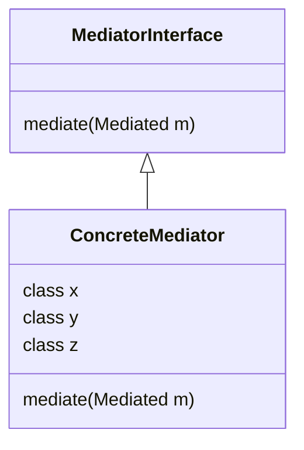

# The Mediator
> Reduce copupling and organize complex dependencies between a number of tightly coupled classes

Don't have all classes depend on all other classes, create a mediator to handle this relationships

