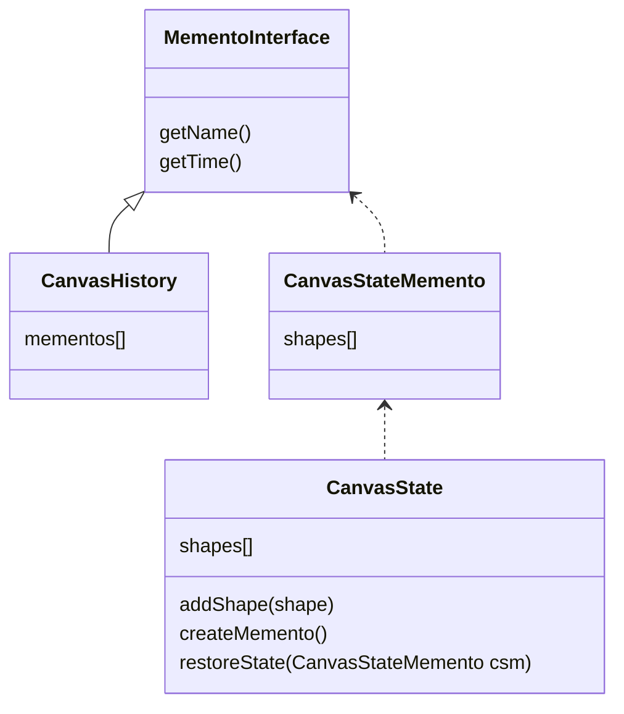

# Memento
Save a snapshot of an object without revealing the details of its implementation and while preventing other objects from modifying the data.

```mermaid
classDiagram

class MementoInterface
class CanvasHistory
class CanvasState
class CanvasStateMemento

MementoInterface    :   getName()
MementoInterface    :   getTime()

CanvasHistory   :   mementos[]

CanvasState :   shapes[]
CanvasState :   addShape(shape)
CanvasState :   createMemento()
CanvasState :   restoreState(CanvasStateMemento csm)

CanvasStateMemento: shapes[]

MementoInterface <|-- CanvasHistory
MementoInterface <..    CanvasStateMemento
CanvasStateMemento <..    CanvasState

```