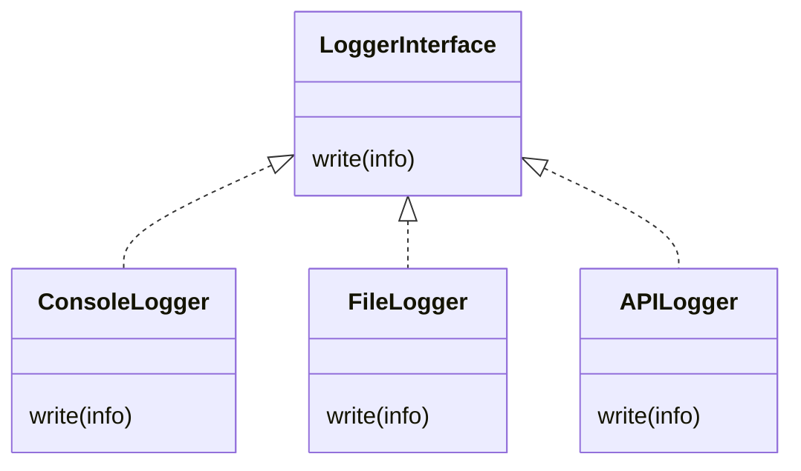

# Null-Object
Define default behaviour of an object so that other objects can interact with it without worrying about its existence.

What if no instance of logger has been created?

Define a *null object* that does nothing but provide a safe interface for other objects to interact with.