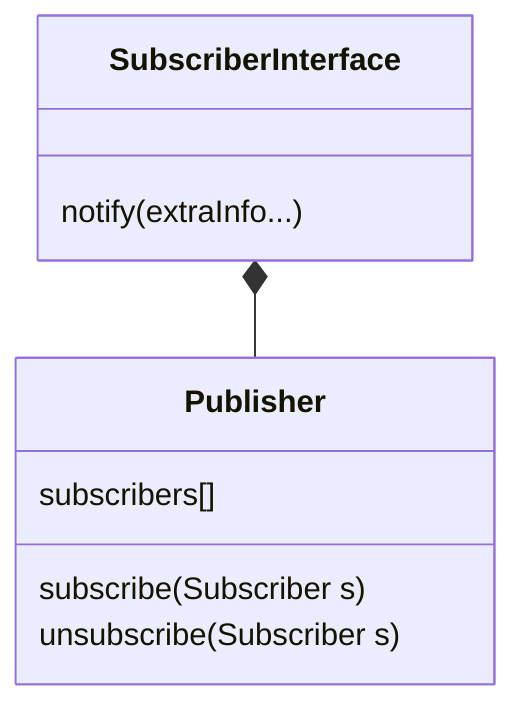

# The Observer
Manage events that not all parts of our code need to be aware of.

## Program as a series of publishers and subscribers

```mermaid
classDiagram

class SubscriberInterface
class Publisher

SubscriberInterface *-- Publisher
SubscriberInterface :   notify(extraInfo...)

Publisher   :   subscribe(Subscriber s)
Publisher   :   unsubscribe(Subscriber s)
Publisher   :   subscribers[]
```