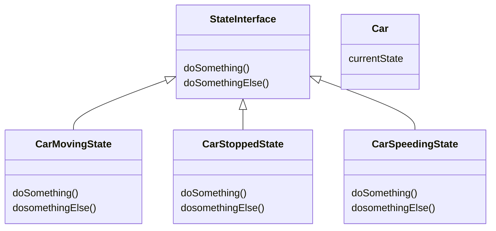

# State
Readable and reusable way to change the behaviour of an object depending on its state.

If else tree will become unmanageable and unscalable

```mermaid
classDiagram

class StateInterface
class CarMovingState
class CarStoppedState
class CarSpeedingState
class Car

Car :   currentState

StateInterface  : doSomething()
StateInterface  : doSomethingElse()

CarMovingState   :   doSomething()
CarMovingState   :   dosomethingElse()

CarStoppedState   :   doSomething()
CarStoppedState   :   dosomethingElse()

CarSpeedingState   :   doSomething()
CarSpeedingState   :   dosomethingElse()

StateInterface <|-- CarMovingState
StateInterface <|-- CarStoppedState
StateInterface <|-- CarSpeedingState
```