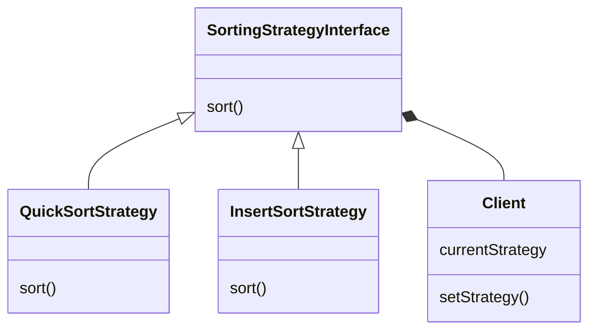

# Strategy
Simplify our code when there are many possible ways of processing data (i.e. sort based on size).
Represent each way as its own strategy class

```mermaid
classDiagram

class SortingStrategyInterface
class QuickSortStrategy
class InsertSortStrategy
class Client

SortingStrategyInterface    :   sort()
QuickSortStrategy           :   sort()
InsertSortStrategy          :   sort()
Client                      :   currentStrategy
Client                      :   setStrategy()

SortingStrategyInterface     <|-- QuickSortStrategy
SortingStrategyInterface     <|-- InsertSortStrategy
SortingStrategyInterface     *--  Client
```
