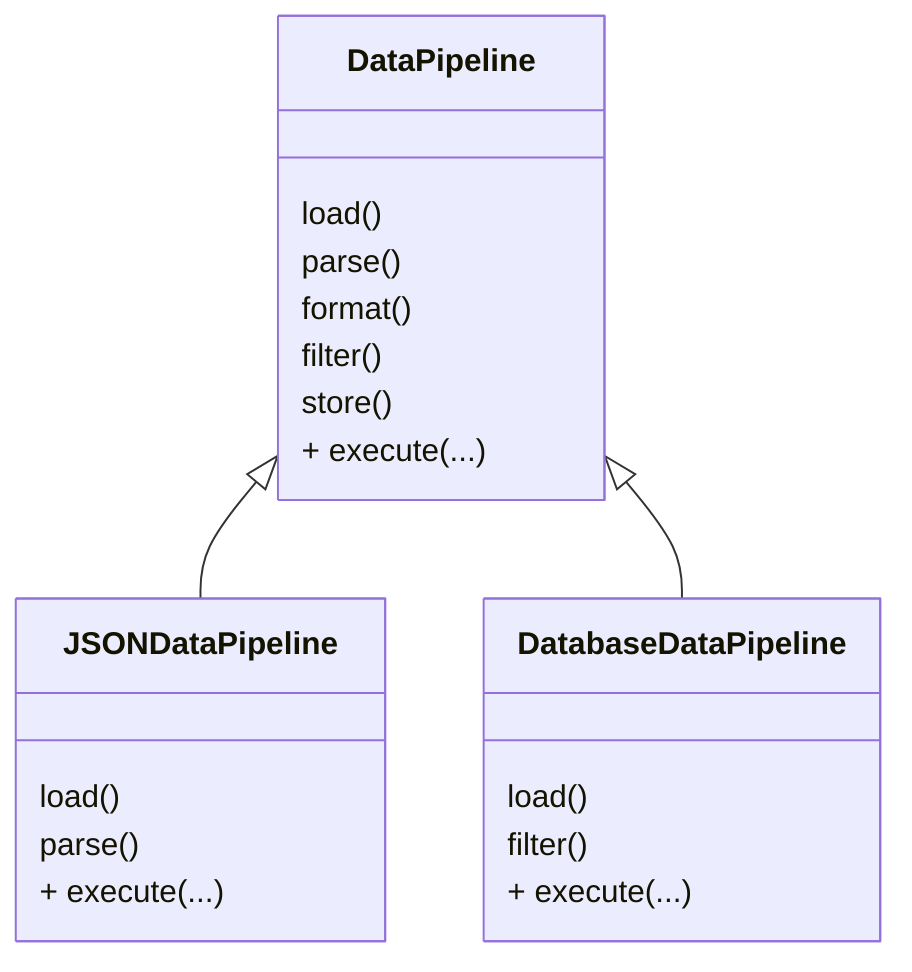

# Template Method
Give us a clean way of representing steps of a process where the implementation of individual steps may vary.

```mermaid
classDiagram

class DataPipeline
class JSONDataPipeline
class DatabaseDataPipeline

DataPipeline :   load()
DataPipeline :   parse()
DataPipeline :   format()
DataPipeline :   filter()
DataPipeline :   store()
DataPipeline :   + execute(...)

JSONDataPipeline : load()
JSONDataPipeline : parse()
JSONDataPipeline : + execute(...)
DatabaseDataPipeline : load()
DatabaseDataPipeline : filter()
DatabaseDataPipeline : + execute(...)

DataPipeline     <|-- JSONDataPipeline
DataPipeline     <|-- DatabaseDataPipeline
```