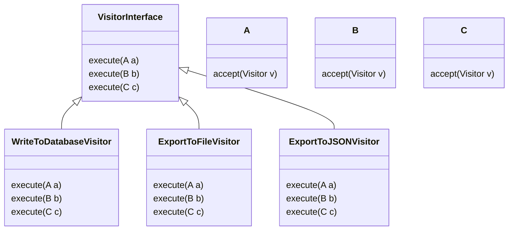

# Visitor
Add similar functionality to many different classes and the functionality doesn't make sense inside the class itself.

Don't add logic to each of the classes, separate it into a specific class or classes.

